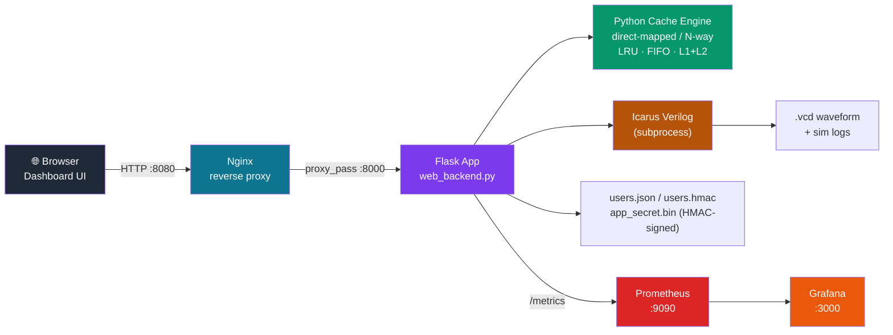
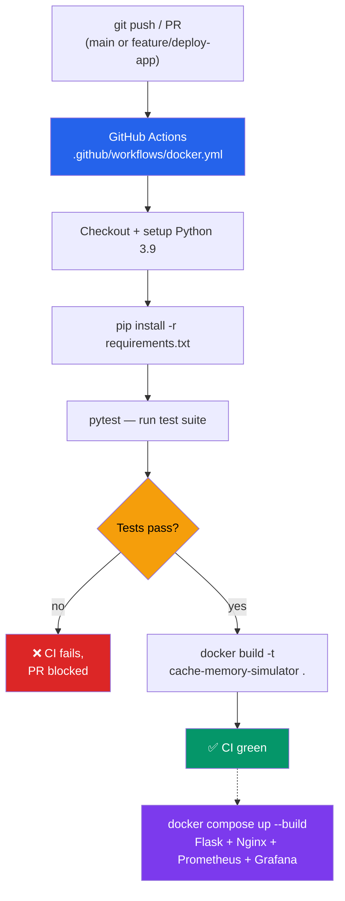
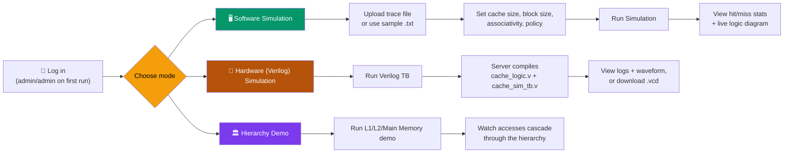

# CacheMap — Cache Memory Simulator

**CacheMap** is a full-stack educational tool for visualizing and simulating CPU cache memory behavior. It pairs a Python software simulator with an actual **Verilog hardware simulation**, allowing users to explore concepts such as Hit/Miss logic, replacement policies (LRU, FIFO), and hierarchical caching (L1/L2) both in software and at the gate level all from one dashboard. The project also integrates a **DevOps pipeline** using **Git, GitHub Actions, Docker, Docker Compose, Nginx, Pytest, Prometheus, and Grafana**, enabling automated testing, containerized deployment, continuous integration, reverse-proxy management, and real-time application monitoring.

## 📸 Interface Screenshots

### Main Dashboard
Configure cache parameters, upload trace files, and view real-time hit/miss statistics.


### Interactive Logic Diagram
An SVG circuit diagram that lights up (green/red) to show Tag Match, Valid bit, and AND/MUX logic driving a Hit or Miss.


### Hardware Verification (Verilog)
Raw output logs from the Icarus Verilog simulation, run server-side.
.jpg)

More screenshots (waveform viewer, admin panel, truth tables) are in the [`Assets`](Assets) folder.

## 🚀 Key Features

| Category | What it does |
|---|---|
| **Dual simulation engine** | **Software mode** runs an instant Python simulation with configurable cache size, block size, associativity, and replacement policy. **Hardware mode** compiles and runs real Verilog testbenches (`cache_logic.v`, `cache_sim_tb.v`) via **Icarus Verilog**, producing accurate timing diagrams. |
| **Interactive visualizations** | A dynamic logic diagram shows how tag matches and valid bits resolve to a hit or miss; an integrated **WaveDrom**-style viewer renders digital timing waveforms in the browser. |
| **Cache hierarchy demo** | Simulates L1, L2, and main-memory interaction on a single request. |
| **Accounts & admin panel** | User login/signup, an admin panel for user management, and per-user activity logging. |
| **Tamper-evident storage** | The user database is HMAC-signed so manual edits to `users.json` are detected and rejected. |
| **DevOps-ready deployment** | Dockerized Flask app behind an Nginx reverse proxy, with Prometheus metrics scraping and a Grafana datasource wired up out of the box. |
| **Continuous Integration** | A GitHub Actions workflow installs dependencies, runs the `pytest` suite, and builds the Docker image on every push/PR. |

## 🏗️ Architecture



*(GitHub renders Mermaid diagrams natively in the README. If viewing elsewhere, see the plain-text fallback below.)*

<details>
<summary>Plain-text fallback</summary>

```
                ┌───────────┐      ┌──────────────┐      ┌─────────────┐
  Browser ───▶  │   Nginx   │ ───▶ │  Flask app   │ ───▶ │   Icarus    │
 (dashboard)    │  :8080    │      │ web_backend  │      │   Verilog   │
                └───────────┘      │  .py :8000   │      │ (subprocess)│
                                    └──────┬───────┘      └─────────────┘
                                           │
                            ┌──────────────┼───────────────┐
                            ▼                              ▼
                     users.json / users.hmac      Python cache-sim engine
                     (HMAC-signed, app_secret.bin) (direct-mapped / N-way,
                                                      LRU / FIFO, L1+L2)

        Prometheus (:9090) scrapes Flask /metrics  →  Grafana (:3000)
```
</details>

## ⚙️ DevOps Integration

CacheMap ships with a production-style DevOps stack, not just an app:



- **CI (GitHub Actions):** `.github/workflows/docker.yml` triggers on pushes to `main`/`feature/deploy-app` and on PRs into `main`. It installs Python dependencies, runs `pytest` (`cms/tests/`), and then builds the Docker image to confirm it's shippable.
- **Containerization:** The Flask app is packaged with a `Dockerfile` (Python 3.11-slim base). `docker-compose.yml` orchestrates it alongside supporting infra.
- **Reverse proxy:** Nginx (`nginx/nginx.conf`) sits in front of Flask, terminating the public port (`8080`) and forwarding to the app container (`8000`).
- **Observability:** Flask exposes a `/metrics` endpoint that Prometheus (`prometheus/prometheus.yml`) scrapes every 5s; Grafana is pre-wired to read from Prometheus as a datasource for building dashboards.
- **Restart policy:** All Compose services use `restart: unless-stopped` for resilience in a long-running deployment.

| Component | Role | Config file |
|---|---|---|
| GitHub Actions | CI: test + Docker build gate | `.github/workflows/docker.yml` |
| Docker | Packages the Flask app | `Dockerfile` |
| Docker Compose | Orchestrates the full stack | `docker-compose.yml` |
| Nginx | Reverse proxy / public entrypoint | `nginx/nginx.conf` |
| Prometheus | Metrics scraping | `prometheus/prometheus.yml` |
| Grafana | Metrics visualization | *(datasource volume mount in `docker-compose.yml`)* |

## 🛠️ Prerequisites

**Run with Docker (recommended)** — only Docker and Docker Compose are required.

**Run locally without Docker:**
- **Python 3.11+** to run the Flask server.
- **Icarus Verilog** to compile the `.v` testbenches:
  - Windows: [Download Icarus Verilog](https://bleyer.org/icarus/) (add it to `PATH` during install)
  - Linux: `sudo apt-get install iverilog`
  - macOS: `brew install icarus-verilog`
- **GTKWave** (optional) — to view downloaded `.vcd` waveform files offline.

## 📦 Getting Started

### Option A: Docker Compose (Flask + Nginx + Prometheus + Grafana)

```bash
git clone https://github.com/Sarvagya-24-chaturvedi/Cache-Memory-Simulator.git
cd Cache-Memory-Simulator/cms
docker compose up --build
```

| Service    | URL                      | Container name    | Notes |
|------------|--------------------------|--------------------|-------|
| Dashboard  | http://localhost:8080    | `cache-nginx`      | Public entrypoint, proxies to Flask |
| Flask app  | (internal only, `:8000`) | `cache-flask`      | Not published directly to the host |
| Prometheus | http://localhost:9090    | `cache-prometheus` | Scrapes `flask:8000/metrics` every 5s |
| Grafana    | http://localhost:3000    | `cache-grafana`    | Pre-configured Prometheus datasource |

### Option B: Run the Flask app directly

```bash
git clone https://github.com/Sarvagya-24-chaturvedi/Cache-Memory-Simulator.git
cd Cache-Memory-Simulator/cms
pip install -r requirements.txt
python web_backend.py
```

Then open `http://127.0.0.1:8000`.

**Default admin credentials:** `admin` / `admin` — change these immediately after first login.

## 🔐 Security & Auto-Generated Files

On first run, the app creates the following in `cms/`. Do not delete or hand-edit them:

| File              | Purpose |
|-------------------|---------|
| `app_secret.bin`  | Cryptographically random 32-byte key used to sign session tokens and compute the user-database HMAC. |
| `users.json`      | Stores usernames, salted/hashed passwords, and roles. |
| `users.hmac`      | SHA-256 HMAC of `users.json`, checked on every load. A mismatch (e.g. from manually editing a role to `admin`) causes the app to reject the file. |

## 📂 Project Structure

```text
Cache-Memory-Simulator/
├── Assets/                  # Screenshots used in this README
└── cms/
    ├── web_backend.py       # Flask app: auth, admin API, simulator engine, Verilog runner
    ├── binary_store.py      # Helper for encoding/reading binary trace data
    ├── cache_logic.v        # Verilog: cache controller & hit/miss logic
    ├── cache_sim_tb.v       # Verilog testbench: drives signals, emits waveform
    ├── mem_sequence*.txt    # Sample memory access trace files
    ├── requirements.txt     # Python dependencies
    ├── Dockerfile           # Flask app image
    ├── docker-compose.yml   # Flask + Nginx + Prometheus + Grafana stack
    ├── nginx/nginx.conf     # Reverse proxy config
    ├── prometheus/prometheus.yml
    ├── static/              # Frontend JS/CSS (charts, waveform viewer, theme)
    ├── templates/           # Dashboard HTML (index.html)
    └── tests/               # Automated tests (run in CI)
```

## 🎮 How to Use



| Mode | Steps |
|---|---|
| **1. Software simulation** | Upload a `.txt` trace file (e.g. `read 4 0x10`, `write 4 0x20`) or use a sample from `mem_sequence.txt` / `mem_sequence2.txt` → set cache size, block size, associativity, and replacement policy → click **Run Simulation** → view hit/miss stats in the Results tab and watch the logic diagram react to each access. |
| **2. Hardware (Verilog) simulation** | Click **Run Verilog TB** → the server compiles `cache_logic.v` and `cache_sim_tb.v` with Icarus Verilog → check the **Hardware (Logs)** tab for raw output → check the **Waveform Viewer** tab for the timing diagram, or download the `.vcd` to inspect in GTKWave. |
| **3. Hierarchy demo** | Run the built-in L1/L2/main-memory demo to see how accesses cascade through the cache hierarchy. |

## 📝 License

This project is open-source and available under the MIT License.
