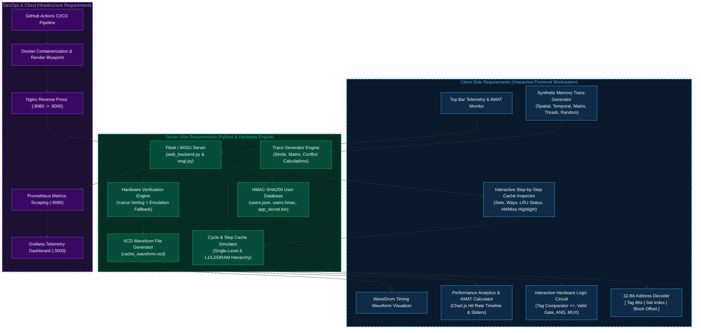

# CacheMap — Cache Memory Simulator & Hardware Verifier

An interactive, executive-grade computer architecture simulation, hardware verification, and DevOps monitoring platform. **CacheMap** combines high-precision software cache state modeling with cycle-accurate Verilog hardware verification, automated memory trace generation, 32-bit address decomposition, real-time AMAT analytics, and a full observability stack (Docker, Nginx, Prometheus, Grafana).

---

## Proposed System Architecture



---

## Core Capabilities

- **Interactive Step-by-Step Cache Inspector**:
  - Time-travel debugging with Play, Pause, Step Next, Step Prev, and scrubber controls.
  - Visual matrix of Cache Sets and Associative Ways showing Valid, Dirty, Tag, and LRU eviction status with live Hit (emerald) and Miss (rose) highlights.
- **Automated Memory Sequence Generator & Benchmarks**:
  - Spatial Locality / Sequential Stride (contiguous array scans).
  - Temporal Locality Loop (tight loops over working sets).
  - Matrix Row-Major vs Column-Major Traversals (cache locality optimization demonstrations).
  - Cache Conflict & Set Thrashing (targeted collision generator).
  - Uniform Random Distribution.
  - Custom stride, address boundary, and read/write ratio configurations with 1-click load and export.
- **32-Bit Address Bit Decoder**:
  - Real-time bit slicing into `[ Tag Bits | Set Index Bits | Block Offset Bits ]`.
  - Binary and hexadecimal representations synchronized with active cache geometry.
- **Interactive Hardware Logic Circuit**:
  - Dynamic vector schematic showing Tag Comparator (`==`), Valid Bit Gate, Hit Decision AND Gate, and Output MUX with animated signal propagation.
- **Performance Telemetry & AMAT Calculator**:
  - Cumulative hit rate convergence curves and hit/miss distribution charts.
  - Interactive AMAT parameter sliders for Hit Time and DRAM Miss Penalty.
- **Multi-Level Hierarchy Simulation**:
  - Multi-tier pipeline model: L1 Cache (32KB, 4-Way) -> L2 Cache (256KB, 8-Way) -> DRAM with Write-Back accounting.
- **Hardware Verilog Verification & Waveforms**:
  - Server-side compilation of IEEE-1364 Verilog modules (`cache_sim_tb.v`, `cache_logic.v`) using Icarus Verilog with cycle-accurate software emulation fallback.
  - Embedded WaveDrom digital timing diagrams and raw `.vcd` waveform export.
- **Cryptographic Security**:
  - PBKDF2-HMAC-SHA256 user database integrity verification (`users.hmac`) with 32-byte secret key and session tokens.

---

## DevOps Stack & Observability

| Component | Role | Config file |
|---|---|---|
| **GitHub Actions** | CI: test + Docker build gate | `.github/workflows/deploy.yml` |
| **Docker** | Multi-stage production container with `iverilog` | `Dockerfile` |
| **Docker Compose** | Orchestrates Flask + Nginx + Prometheus + Grafana | `docker-compose.yml` |
| **Nginx** | Reverse proxy / public entrypoint (:8080) | `nginx/nginx.conf` |
| **Prometheus** | Metrics scraping from `/metrics` (:9090) | `prometheus/prometheus.yml` |
| **Grafana** | Real-time analytics dashboard (:3000) | `grafana/` |
| **Render Cloud** | PaaS 1-click blueprint deployment | `render.yaml` |

---

## Quick Start (Local Setup)

### 1. Clone the Repository
```bash
git clone https://github.com/Sarvagya-24-chaturvedi/Cache-Memory-Simulator.git
cd Cache-Memory-Simulator
```

### 2. Set Up Virtual Environment & Dependencies
```bash
python3 -m venv venv
source venv/bin/activate
pip install -r cms/requirements.txt
```

### 3. Run the Application
```bash
cd cms
python web_backend.py
```
Open your browser and navigate to `http://127.0.0.1:8000` (or `http://127.0.0.1:5050`).

- **Default Administrator**: `admin` / `admin`
- **Guest Access**: Click "Explore as Guest (Instant Access)" for 1-click frictionless access.

---

## Production Deployment

### Option 1: Docker (Recommended)
Build and run the containerized application with integrated Icarus Verilog:
```bash
cd cms
docker build -t cache-simulator .
docker run -p 8000:8000 cache-simulator
```

### Option 2: Docker Compose (Full Stack with Prometheus & Grafana)
```bash
cd cms
docker compose up -d
```
- Web Application: `http://localhost:8080`
- Prometheus Metrics: `http://localhost:9090`
- Grafana Dashboard: `http://localhost:3000`

### Option 3: Cloud PaaS (Render / Railway / Fly.io / Heroku)
The repository includes standard deployment manifests:
- `render.yaml`: 1-click Render blueprint deployment.
- `Procfile`: WSGI entrypoint for Railway, Heroku, or Fly.io (`gunicorn --chdir cms wsgi:app`).
- `cms/wsgi.py`: Production WSGI wrapper.

---

## Testing & Verification

Run the automated test suite:
```bash
cd cms
python -m unittest discover -s tests
```

---

## Project Structure

```text
Cache-Memory-Simulator/
├── Procfile                    # Cloud PaaS WSGI entrypoint
├── render.yaml                 # Render cloud deployment blueprint
├── .github/
│   └── workflows/
│       └── deploy.yml          # CI test and Docker build workflow
├── cms/
│   ├── Dockerfile              # Multi-stage production container with iverilog
│   ├── docker-compose.yml      # Full monitoring stack (Nginx + Prometheus + Grafana)
│   ├── requirements.txt        # Pinned Python dependencies
│   ├── web_backend.py          # Flask backend, simulation engines, & API routes
│   ├── wsgi.py                 # WSGI application wrapper
│   ├── cache_logic.v           # Verilog hardware module
│   ├── cache_sim_tb.v          # Verilog testbench
│   ├── static/
│   │   ├── style.css           # Executive dark slate design system
│   │   └── app.js              # Interactive client, step controller, & charts
│   ├── templates/
│   │   └── index.html          # Modular workstation layout
│   └── tests/
│       └── test_app.py         # Automated test suite
└── README.md
```

---

## License
MIT License.
